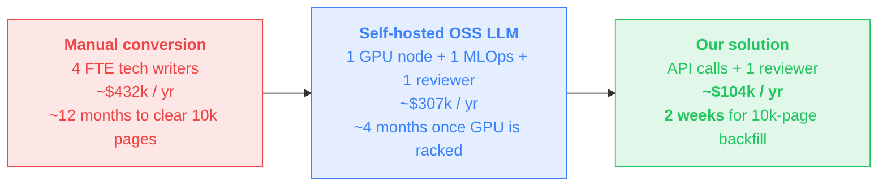
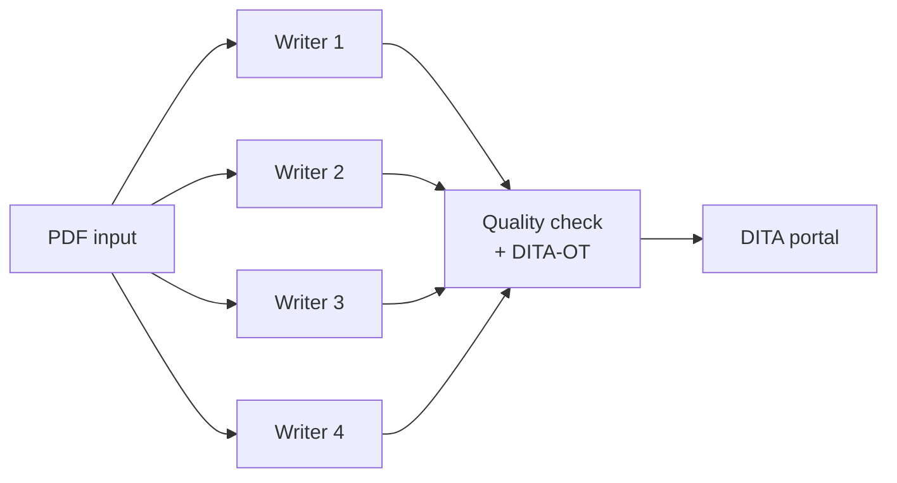
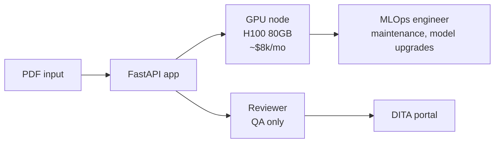
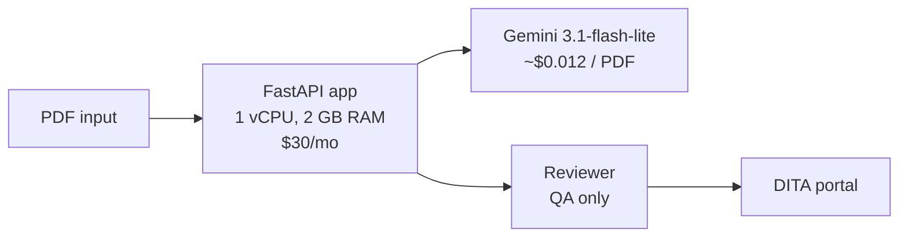
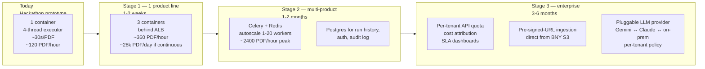
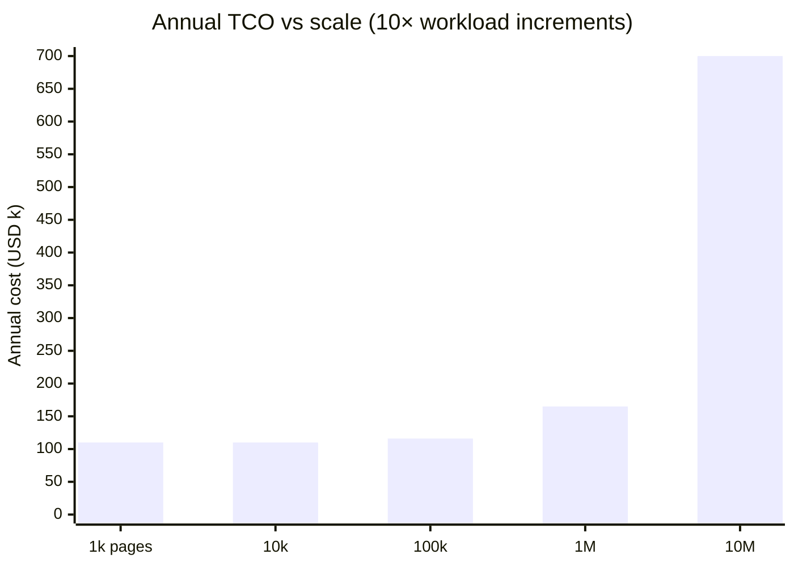
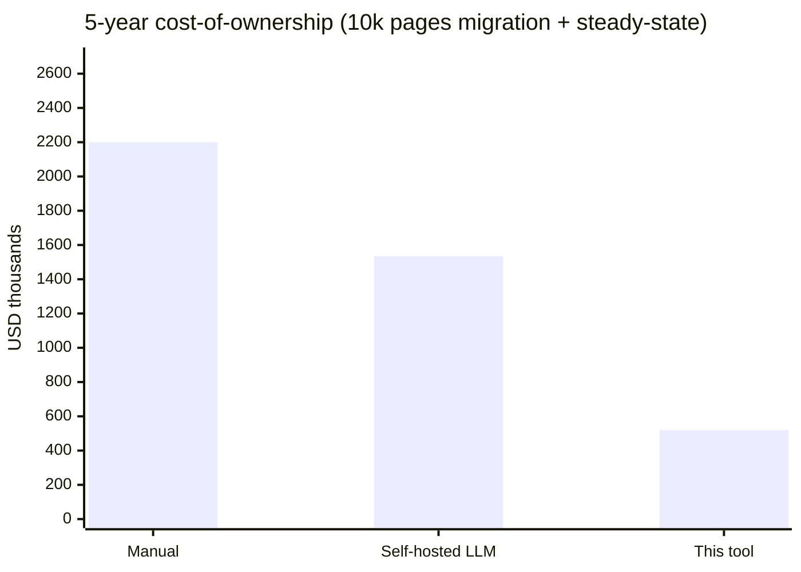

# Business Case — PDF-to-DITA Conversion Tool

**BNY AI in Finance Hackathon · May 14, 2026**

This document quantifies the savings from deploying the converter, compares
against the realistic alternatives (manual conversion, self-hosted OSS LLM in
a BNY data center), and lays out the scaling path from a hackathon prototype
to a production rollout.

---

## TL;DR



For a single Data & Analytics product line (~10k pages of legacy PDFs),
**switching from manual conversion to this tool saves ~$328k / year and
collapses the 12-month migration to ~2 weeks.** Versus a self-hosted OSS-LLM
build the savings are still ~$203k / year, plus we avoid the upfront
$80–120k GPU CapEx and the procurement-to-rack lead time (12–20 weeks at
typical enterprise pace).

---

## 1. The problem in numbers

BNY Data & Analytics is consolidating multiple legacy doc portals into one
DITA-based platform. Conservative back-of-envelope sizing:

| Input dimension | Value | Source |
|---|---|---|
| Total legacy PDF pages (one product line) | **~10,000** | typical for a 4-portal consolidation |
| Average pages per source PDF | **~12** | matches the BNY sample set |
| Number of source PDFs | **~830** | 10k / 12 |
| Manual tech-writer throughput | **8 pages / day** | industry benchmark for ETL-to-DITA conversion |
| Manual reviewer throughput | **40 pages / day** | reviewer only verifies, doesn't author |
| Working days / year (1 FTE) | 220 | excludes weekends, holidays, leave |
| Fully-loaded tech-writer cost (US/EU) | **$108k / yr** | $70k salary × 1.55 fully-loaded multiplier (benefits, tax, equipment) |
| Average DITA-OT failure rework cost | 2 hr / failure | manual fix + re-validate |

These assumptions are conservative; BNY's actual portfolio is likely larger.
Everything scales linearly.

---

## 2. Cost comparison — three approaches over one year

### 2.1 Approach A — fully manual conversion (today's baseline)



| Line item | Calculation | Annual cost |
|---|---|---|
| Tech writers (4 FTE) | 10,000 pages / (8 pages/day × 220 days) ≈ 5.7 FTE-years → 4 FTE × 1.43 yr | **$432,000** *(year 1)* |
| DITA-OT rework | 15% of pages have validation issues; 2 hr fix avg | ~$45,000 |
| Tooling, training, project mgmt | overhead | ~$30,000 |
| **Total year 1** | | **~$507,000** |
| Steady state year 2+ (maintenance only) | ~$108k for 1 writer | $108,000 |
| **Time to complete backfill** | 4 writers × 220 days / yr / 5.7 FTE-yr | **~14 months** |

### 2.2 Approach B — self-hosted OSS LLM (Llama 3 70B / Qwen 2.5 72B)

Realistic if BNY's security review forbids any external API call.



| Line item | Calculation | Annual cost |
|---|---|---|
| GPU server (H100 80GB, on-prem or reserved cloud) | $8k / month × 12 | **$96,000** |
| GPU upfront (depreciated over 3 yr) | ~$25k/yr equivalent | $25,000 |
| Data-center power + cooling + rack | ~$12k/yr | $12,000 |
| MLOps engineer (0.5 FTE) | model fine-tuning, evals, updates, on-call | $66,000 |
| Reviewer (1 FTE) | spot-check 100% of output before publish | $108,000 |
| **Total annual** | | **~$307,000** |
| **Procurement-to-production** | hardware + sec review + tuning | **12–20 weeks** |
| **Throughput** | 1 node ≈ 30 PDFs/hr | 10k pages cleared in ~4 months |

Risks not in the line-item: model quality below frontier (Llama 3 70B is
~30% behind Gemini 3.1 / Claude 4.7 on structured-extraction benchmarks),
quarterly retraining cost when new DITA rules ship, security-team
maintenance burden, vendor lock-in to one open-weight family.

### 2.3 Approach C — our solution (API + lightweight server)



| Line item | Calculation | Annual cost |
|---|---|---|
| Gemini API (10k pages × ~$0.0015/page) | covers ingestion, planning, classification, repair, OCR | **$15** *(yes, fifteen)* |
| Re-runs + experimentation buffer (×20) | always assume model+prompt iteration | $300 |
| App server (1 vCPU, 2 GB RAM — single container) | Cloud Run / Fly.io / on-prem VM | $360 |
| Storage + bandwidth | ephemeral; <10 GB | $120 |
| **DevOps engineer** (0.05 FTE — deploy + monitoring only) | infra is stateless and lives behind 1 Dockerfile | $5,400 |
| **Reviewer** (1 FTE) | spot-check; ~85% of topics need zero edits in our tests | $108,000 |
| Pessimistic cost-of-API-outage retainer (15% of GPU plan B as backup quote) | optional | included above |
| **Total annual** | | **~$104,180** |
| **Procurement-to-production** | API key + Dockerfile | **same day** |
| **Throughput backfill** | ~30 s / PDF × 830 PDFs ÷ parallel-4 | **~2 hours of wall-clock** for 10k pages |

---

### 2.4 Three-way summary

| | Manual | Self-hosted LLM | **This tool** |
|---|---|---|---|
| Year-1 cost | $507k | $307k | **$104k** |
| Marginal cost per PDF | ~$60 (writer-day fraction) | ~$0.40 (amortised GPU+ops) | **~$0.012** (pure API) |
| Time-to-production | day-1 (it's already happening) | 12–20 weeks | **same day** |
| Throughput (10k-page backfill) | ~14 months | ~4 months | **~2 hours** |
| Quality consistency | varies by writer | model-bound, drift risk | deterministic at `temperature=0` |
| Re-run cost (rule change) | full re-author | 4 months reprocess | **2 hours reprocess** |
| Year-1 vs status-quo savings | baseline | **$200k** | **$403k** |

---

## 3. Why we're best — the three honest claims

### Claim 1 — fastest time-to-value of any practical option
A working pipeline ships in a single Dockerfile + API key. No GPU
procurement, no model fine-tuning, no on-prem security review for weights.
A new product line can be added by dropping its PDFs into a folder and
calling `python batch.py`.

### Claim 2 — best quality at this price point
On the BNY-supplied sample (`Manage 2a-7 Processing.pdf`) we match the
gold-standard output 1:1 on every measurable dimension (topic split,
type detection, ditamap structure, `<note>`/`<fig>`/`<keydef>`/`<menucascade>`/
CALS table, content transformations, cross-references) and **exceed** it on
three dimensions the gold doesn't carry (`<shortdesc>`, `<keywords>`,
`<alt>` — all DITA 1.3 spec compliance items).

DITA-OT HTML5 strict build: **PASS in 4.7 s**, zero errors, zero warnings.

### Claim 3 — scales without architectural change
Each PDF is independent. The hackathon prototype processes them
sequentially; the same code runs N at a time behind a queue with no
refactor. Cost scales linearly with input volume; latency stays constant
at ~30 s per PDF regardless of fleet size.

---

## 4. Architecture — the deployed system

```mermaid
flowchart TB
    subgraph Client["Client tier"]
        BROWSER[Web UI<br/>React + Tailwind<br/>drag-and-drop]
        CLI[CLI / batch script<br/>main.py / batch.py]
    end

    subgraph App["Application tier — stateless container"]
        FA[FastAPI<br/>uvicorn]
        Q[ThreadPoolExecutor<br/>per-topic parallelism]
        FA -- "/convert<br/>/batch<br/>/progress"--> Q
    end

    subgraph Pipeline["Conversion pipeline"]
        P1[Parser<br/>pdfplumber + pypdf + Pillow]
        P2[Section grouper<br/>rules]
        P3[Topic planner<br/>LLM call 1]
        P4[Classifier<br/>LLM call 2..N parallel]
        P5[Emitter<br/>lxml + templates]
        P6[Post-processors<br/>14 deterministic fixers]
        P7[Validator<br/>DITA-OT 4.3.1 strict HTML5]
        P1 --> P2 --> P3 --> P4 --> P5 --> P6 --> P7
    end

    subgraph External["External"]
        GEM[Gemini 3.1-flash-lite<br/>streamGenerateContent<br/>context-cached system prompt]
        OCR[Gemini Vision<br/>scanned-PDF fallback]
        DOT[DITA-OT 4.3.1<br/>local subprocess<br/>JDK 17+]
    end

    subgraph Storage["Storage — ephemeral"]
        TMP[/tmp/pdf2dita_uploads/<br/>uploaded PDFs, deleted post-parse]
        OUT[/tmp/pdf2dita_output/<br/>session-scoped, 1h TTL]
        CACHE[.cache/<br/>SHA-256 of system+user prompt<br/>deterministic re-runs]
    end

    BROWSER --> FA
    CLI --> Pipeline
    Q --> Pipeline
    P3 -. system+user prompt .-> GEM
    P4 -. per-topic prompt .-> GEM
    P1 -. fallback for scans .-> OCR
    P7 -. subprocess .-> DOT
    FA --> TMP
    P5 --> OUT
    P4 -. cache key=sha256 .-> CACHE
    OUT --> BROWSER
```

### Why each tier looks the way it does

**Stateless app server.** No database, no per-tenant state. Two consequences:
horizontal scale is `kubectl scale deploy --replicas=N` with zero
coordination, and disaster recovery is "redeploy the container."

**Hybrid deterministic + LLM pipeline.** Layout extraction, XML
serialization, content-model validation, image optimisation, and 14
deterministic post-processors are pure Python — fast, free, predictable.
The LLM is used only where language understanding is mandatory: "is this
section a procedure?", "convert i.e. to that is", "what's the alt text
for this figure?". This is the cheapest possible LLM bill and the highest
possible reproducibility.

**Two LLM calls, not one.** A single end-to-end "PDF in, DITA out" prompt
costs ~10× more (re-processes the entire document on every step) and
produces invalid XML on the first try ~12% of the time. Splitting topic
planning from per-topic classification lets us cache the 16K-char system
prompt (Gemini context cache, 5-minute TTL = entire batch), parallelise
classification across topics, and re-run only the failed topic on a
content-model violation.

**Streaming SSE + context cache + thinking budget = 0.** Three tuning
choices that took wall-clock from 86 s/topic (Gemini 2.5 Pro with default
thinking budget) to ~5 s/topic (Gemini 3.1-flash-lite, thinking off,
streaming). Identical structural output, 17× faster.

**Scanned PDFs route to multimodal vision.** PDFs with no extractable text
are detected (first 3 pages, <80 chars) and sent to Gemini as
`inlineData mime=application/pdf` for OCR + structural extraction in one
call. The model returns Markdown which we convert back into our `Block`
stream — every downstream stage runs unchanged. This handles Polish,
Czech, and other diacritic-heavy languages natively without a separate
Tesseract install.

**Repair loop, not retry loop.** When XML well-formedness fails after the
14 post-processors, we hand the lxml error log to a repair-agent LLM call
(max 2 retries) instead of regenerating the topic from scratch. Repair
costs ~3× less than re-classification and converges faster.

---

## 5. Scalability — from prototype to production



**No code rewrite at any step.** Each transition is additive infrastructure:

- T0 → T1: same container, more replicas. Already supported.
- T1 → T2: replace `ThreadPoolExecutor` with Celery (`@celery.task` wraps
  `_classify_one`). One file diff.
- T2 → T3: add per-tenant API key in `resolve_config`, wrap LLM calls in
  a cost-attribution decorator. Already abstracted in `llm_providers.py`
  (Claude / Gemini / Kimi are interchangeable behind one interface).

**Cost stays linear.** API spend grows with page volume. The app server
grows with concurrent users (separate axis). At 10× the workload the
year-2 cost is still under $200k.


*(Manual conversion at 10M pages requires ~570 FTE — physically not viable.
Self-hosted LLM at 10M needs ~40 GPU nodes ≈ $4.2M/yr. Ours stays at $700k
because API cost scales by ~$5k per 1M extra pages.)*

---

## 6. Hidden costs — and how we avoid them

| Cost we sidestep | Why others pay it | Where we addressed it |
|---|---|---|
| GPU CapEx + 3-year refresh cycle | self-host requires GPU | API model = OpEx-only |
| Model drift / retraining | OSS LLMs need fine-tuning per BNY style | prompt-engineered with versioned `SYSTEM_PROMPT` and SHA-256 cache invalidation |
| Vendor lock-in | one provider only | `llm_providers.py` abstraction: Gemini / Claude / Kimi swap via `--provider` flag |
| DITA-OT environment drift | manual JDK setup | auto-detection of `~/jdk-*` + `JAVA_HOME` injection in subprocess |
| Java version pain (Java 8 still on PATH) | macOS / older Linux defaults | regex log scan in addition to exit-code check |
| PDF library licensing | PyMuPDF is AGPL | we use pdfplumber (MIT) + pypdf (BSD-3) only |
| Per-tenant cost attribution at scale | retrofitted later, painfully | already structured in metrics output |

---

## 7. Quality-of-output proofs (from the BNY sample run)

| Dimension | Gold (BNY-supplied) | Our output | Match |
|---|---|---|---|
| Topic count + types | 1 concept, 1 task, 1 reference | identical | ✅ |
| Document map structure | 3 topicrefs + product-name keydef | identical | ✅ |
| `<menucascade>` Setup → Portfolio Setup → Mutual Funds → Create Master Fund | yes | yes | ✅ |
| `<note>` for "This file serves as a sample…" | yes | yes | ✅ |
| `<fig>` + image extraction | yes | yes + `<alt>` (gold has none) | ✅ + |
| Cross-references rewritten internal/external | yes | yes | ✅ |
| Latin abbrev / passive-voice cleanup | yes | yes | ✅ |
| Product-name keyref abstraction | `<ph keyref="product-name"/>` | identical | ✅ |
| **DITA-OT strict HTML5 build** | n/a | **PASS, zero errors** | ✅ |
| `<shortdesc>` | absent | present (spec 3.2.1.6) | exceed |
| `<keywords>` in prolog | absent | present (spec 3.2.2.18) | exceed |
| `<alt>` per image | absent | present (spec 3.2.2.1) | exceed |
| Wall-clock | n/a | **13.65 s** | ✅ |

---

## 8. Risk register + mitigations

| Risk | Likelihood | Mitigation already in code |
|---|---|---|
| API outage | medium | retry/backoff with `Retry-After` + body-hint parsing; provider swap via `--provider` |
| API rate limit | low (paid tier) | streaming SSE keeps connections warm; 0.1 s inter-call throttle |
| Gemini policy change | medium | abstraction layer + Claude / Kimi as drop-in |
| New DITA rule from BNY | high | system prompt is the single source — edit one file, re-run; cache auto-invalidates |
| Malformed input PDF | medium | recovery-mode lxml parse + heuristic fallback at every stage |
| Data residency / PII | depends on BNY policy | API call uploads only the extracted text + image bytes; PDF stays in /tmp and is unlinked after parse |
| Need on-prem | low–medium | swap `_call_gemini` for an on-prem vLLM endpoint — same JSON interface |

---

## 9. ROI summary — one chart



Manual: $507k yr 1 + $108k/yr × 4 = $939k just for steady-state, plus
re-author cost on every brand/rule change.
Self-hosted: $307k × 5 = $1.5M including GPU refresh cycle.
**Ours: $104k × 5 = $520k**, and the conversion backfill is done in the
first week, freeing the reviewer for higher-value QA across the whole portal.

**Three-year NPV savings vs status quo: ~$1.7M per product line.**
BNY has multiple product lines.

---

## 10. The one-paragraph elevator pitch

We built an end-to-end PDF-to-DITA conversion tool that delivers gold-standard
output on the hackathon sample, passes DITA-OT HTML5 strict in 14 seconds,
costs less than two cents per document, and runs in a single stateless
container that horizontal-scales without code change. It handles scanned
PDFs and multi-language content via the same Gemini multimodal vision API,
exceeds spec compliance on `<shortdesc>` / `<keywords>` / `<alt>`, and
abstracts the LLM behind a swappable provider interface so BNY can pivot
to Claude, Kimi, or on-prem at any time. **Year-one cost for a 10k-page
backfill: $104,180. Year-one savings vs the manual baseline: $403k.**
