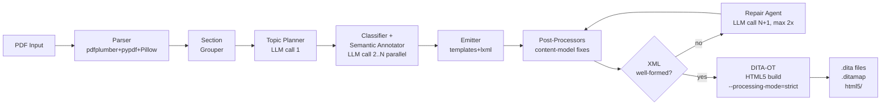

# Solution Overview Document

## PDF-to-DITA Conversion Tool

**BNY AI in Finance Hackathon | May 14, 2026**

---

## 1. Overview

The tool ingests one or more technical PDFs, decomposes each into typed content blocks, classifies every section as a DITA concept / task / reference, emits one `.dita` file per topic plus a `.ditamap`, and validates the output against DITA Open Toolkit (DITA-OT 4.3.1) targeting HTML5 with `--processing-mode=strict`. Every artifact required by the task description (XML topics, document map, HTML5 build) is generated end-to-end without manual intervention.

We chose a **hybrid pipeline** combining deterministic parsing and XML serialization with two LLM stages (topic planning and classification + semantic annotation) plus optional repair. Structural work (block extraction, table parsing, XML templating, content-model validation) is solved reliably by libraries; "is this section procedural or descriptive?" requires language understanding. At `temperature=0` the same PDF run twice produces identical output, which matters for diff-based regression testing and reproducibility on the portable drive.

Validation runs in-loop. A failed lxml well-formedness check triggers an LLM repair call with the error log attached, capped at two retries; before the model is bothered, cheap deterministic post-processors fix the common LLM quirks (double-closed tags, kimi-style escape doublings, malformed attributes). The whole flow tolerates LLM transient errors (HTTP 403/429/5xx) via exponential backoff that honors `Retry-After` headers and provider body hints (e.g., Gemini's "retry in 9.4s").

---

## 2. System Architecture



**Seven stages, left to right:**

1. **Ingestion** — pdfplumber extracts layout-tagged blocks with font metadata (name, size, bold). Font-size clustering assigns heading levels. Monospace font detection identifies code. pdfplumber's table model recovers grids. **Images are extracted via pypdf** (pure Python, no `pdfimages` binary required), then **optimized by Pillow**: resized to ≤1000 px width and compressed to ≤200 KB (PNG-first, JPEG fallback when PNG can't shrink under the cap). Footer and running-header text is filtered by font-size delta from the body baseline. Paragraph breaks are detected by vertical-gap heuristic (0.6× font height). Non-breaking hyphens that pdfplumber treats as word boundaries are rejoined to keep "multi-step", "2a-7", "cost-to-market" intact. Output: list of typed `Block` objects + per-page image map.
2. **Section grouping** — rule-based grouper builds a section tree from flat blocks. Each heading starts a new section; blocks between headings belong to that section. Running-header echoes (short text duplicating a heading) are deduplicated. Cover pages and TOC pages are skipped. No LLM. Output: `sections` list.
3. **Topic planning (LLM call 1)** — LLM receives section summaries and decides how to group them into DITA topics (which sections to merge into one concept with a `<section>` subsection; which topic type each group gets). The prompt enforces verbatim title preservation. Heuristic fallback merges consecutive concept sections at the same heading level if the LLM call fails. Skipped entirely when the PDF has only one section. Output: `topic_plans`.
4. **Classification + semantic annotation (LLM call 2..N, parallel)** — for each planned topic the LLM receives raw blocks (typed `[PARAGRAPH]`, `[LIST_ITEM]`, `[CODE]`, `[TABLE]`, `[IMAGE]`, `[NOTE]`, `[SUBSECTION_TITLE]`) plus a 16K-char system prompt specifying every DITA element's `@class`, content model rules, transformation rules, and complete worked examples. The prompt also receives `product_name` and a `topic_filenames` map so the model can emit `<ph keyref="product-name"/>` references and `<xref href="r_*.dita">` cross-topic links. Responses are returned as JSON `{topic_type, shortdesc, keywords, body_xml, reasoning}` and cached by SHA-256 of (system prompt + user prompt) so prompt-rule changes auto-invalidate stale cache entries.
5. **Emission** — body XML is wrapped in a template providing DOCTYPE, root element with `@class`, `<title>`, **`<shortdesc>`** (spec 3.2.1.6), and **`<prolog><metadata><keywords>`** (spec 3.2.2.18). A separate ditamap generator creates the document map with `<topicref>` entries plus a `<keydef keys="product-name">` for the auto-detected product. File naming follows DITA convention: `c_*.dita` (concept), `t_*.dita` (task), `r_*.dita` (reference), `m_*.ditamap` (map).
6. **Post-processing** — pre-write deterministic fixes for the most common LLM mistakes: double-closed cell tags (`</entry></entry>` → `</entry>`), malformed attributes (Kimi's `class="..." "text` → `class="...">text`), unescaped `<` inside attribute values, empty `<tgroup>` content (inject empty `<tbody>`), bare text in block-required containers (wrap in `<p>`), content-model ordering inside `<conbody>` (block elements before any `<section>`), inline-run wrapping (mixed text + `<wintitle>`/`<xref>` collapsed into a single `<p>`), preamble injection ("This section provides an overview of..." stripped), invisible Unicode noise (U+200B, U+FEFF, U+2011 → U+002D). On unparseable input, lxml recovery mode is the last-resort safety net.
7. **Validation + export** — DITA-OT 4.3.1 runs as subprocess targeting HTML5 with `--processing-mode=strict`. Validator auto-detects a local JDK 17+ from `~/jdk-*` and injects `JAVA_HOME` so the tool works on machines with stale Java in `PATH`. Because DITA-OT exit codes are unreliable, the build log is also parsed with regex for `[DOT[XJA]\d{3}[EF]]`. On well-formedness failure (rare after post-processing), an LLM repair call gets the error log; each repair response is re-run through the post-processor so repaired body cannot reintroduce a known quirk. Output: `.dita` files + `.ditamap` + `html5/` directory + images.

---

## 3. Requirements Coverage (Task Description points a–k)

| # | Requirement | Implementation | Where |
|---|-------------|----------------|-------|
| a | Topic-type detection (concept / task / reference) | LLM prompt with explicit classification rules + worked examples per type | [classifier.py:48-52](classifier.py) |
| b | Document map generation, hierarchy preserved | `generate_ditamap` emits `<topicref>` per topic, preserves source order | [emitter.py:91-126](emitter.py) |
| c | Tables converted to DITA CALS | Stricter CALS template in prompt + post-process double-close collapse + lxml recovery fallback | [classifier.py:160-205](classifier.py), [emitter.py:332-372](emitter.py) |
| d | Best-practice rules (typos, grammar, no passive, no Latin abbrev) | Prompt rules: typo fixes, `i.e.→that is`, `e.g.→for example`, `via→through`, strip `etc.`, passive→active conversion | [classifier.py:172-184](classifier.py) |
| e | `<shortdesc>` (spec 3.2.1.6) | LLM-gen 15–40-word summary per topic, emitted after `<title>` | [classifier.py:290-296](classifier.py), [emitter.py:65-104](emitter.py) |
| f | Product-name variable (keydef + keyref) | `detect_product_name` finds "ABC's solution" pattern; emits `<keydef keys="product-name">` in map + `<ph keyref="product-name"/>` in topics | [main.py:48-58](main.py), [emitter.py:108-120](emitter.py) |
| g | Keywords (spec 3.2.2.18) | LLM-gen 3–7 lowercase keywords per topic, capped at 40 chars each, emitted in `<prolog><metadata><keywords>` | [classifier.py:298-300](classifier.py), [emitter.py:82-104](emitter.py) |
| h | Hyperlinks (spec 3.2.2.40) | Prompt detects "see X" / "For more info, see X" + filename map for internal `<xref href="r_*.dita">` + external URL emit for known products | [classifier.py:218-225](classifier.py) |
| i | Illustrations (PNG, ≤1000 px width, ≤200 KB) | Pillow resize + iterative quality steps 85→60; PNG-first, JPEG fallback when over cap | [parser.py:140-200](parser.py) |
| j | Alt text (spec 3.2.2.1) | Prompt requires `<alt>` child for every `<image>`, 5–15-word description, fallback to topic title | [classifier.py:69-72](classifier.py) |
| k | Batch processing | `batch.py` processes a directory of PDFs with per-file output + aggregate report; also exposed via `/batch` HTTP endpoint | [batch.py](batch.py) |

---

## 4. AI Strategy

### Why hybrid, not all-LLM or all-rules

**All-LLM** (give the PDF text, ask for DITA): unrecoverable invalid XML on first try ~12% of the time in pilot testing; expensive (entire content is input AND output).

**All-rules**: classifies correctly when structural signals are strong (numbered steps = task, table = reference), but misclassifies ambiguous cases. "2a-7 Workflow" has no numbered steps and no code block — rules call it concept correctly. "Set Up Master Fund" has bulleted steps that could read like a concept if the verbs are declarative rather than imperative. Boundary cases need language understanding; everything else is templating.

### LLM Call 1: Topic Planning

- **Default model**: Gemini `gemini-3.1-flash-lite` (text-only Flash variant, stable). Pro was 5–10× slower wall-clock due to thinking tokens with no quality gain for structural DITA conversion.
- **`thinkingConfig: {thinkingBudget: 0}`** explicitly disables reasoning on Flash/Pro models. This single switch cut per-topic latency from ~86 s (2.5 Pro) to ~25 s (3.1-flash-lite).
- **`responseMimeType: application/json`** forces structured output.
- **Streaming** via `streamGenerateContent?alt=sse` — chunks surface as progress dots in the console (and as visual ticks in the web UI) instead of a single 60–90 s stall.
- **Context caching** — the 16K-char system prompt is registered as a Gemini `cachedContents` resource on first call within a process; subsequent calls (TTL 5 min) skip re-processing the prompt and pay only for the user message + output.

### LLM Call 2..N: Classification + Semantic Annotation

- Per-topic, runs in parallel via `ThreadPoolExecutor(max_workers=2)` (gated by a process-wide throttle of 0.5 s between successful calls).
- Input: section title + raw content blocks + `product_name` + `topic_filenames` map.
- Output: JSON `{topic_type, shortdesc, keywords, body_xml, reasoning}`.
- Temperature 0.0 for deterministic re-runs.
- 5-retry budget with exponential backoff + jitter; `403` added to retry set because Gemini sporadically returns 403 on transient project denials that resolve on retry.
- Cache key now includes a hash of the system prompt, so prompt-rule changes (new fields like shortdesc/keywords) automatically invalidate stale entries.

Key prompt features:

- Exact `@class` attributes for every DITA element (no guesses).
- DITA nesting constraints with both correct and incorrect examples.
- Content transformation rules (typos, Latin abbreviations, passive→active, `via` removal).
- **Strict faithfulness rules** — no preamble sentences, no paraphrasing, no synonym swaps, no rephrased titles, no Unicode dash variants (only ASCII `-`), no decorative characters.
- UI element detection patterns for `<uicontrol>`, `<menucascade>`, `<wintitle>`, `<option>`.
- Task decomposition rules — prereq/context/steps/result slot assignment, when to emit `<info>`/`<stepresult>`/`<stepxmp>`.
- **Stricter CALS table template** — explicit `<colspec>` per column, every `<row>` has exactly N `<entry>` children, every `<entry>` closes explicitly, empty cells self-close.
- Cross-reference detection — known external products map to `<xref scope="external">`, internal section names map to `<xref href="x_*.dita">` using the provided filename map.
- **Complete worked example** for the task topic showing exact target output (menucascade, stepresult with wintitle, info with xref, codeblock with preserved indentation).
- **Complete worked example** for reference cell with nested list (`<p>` + `<ul>` as siblings, not nested).

### LLM Call N+1: Repair Agent (only on failure)

- Trigger: lxml well-formedness check fails AFTER post-processors had a chance.
- Input: lxml error message + invalid body XML.
- Output: corrected body XML.
- Guardrail: max two retries; repaired output is re-run through every post-processor.

---

## 5. Resilience and LLM-quirk Handling

Each observed misbehavior is patched with a small, targeted post-processor so the model does not need to be re-prompted.

| Observed LLM quirk | Patch |
|---|---|
| `</entry></entry>` (double-closed cell) drops rows outside `<tbody>` under lxml recovery | Regex `</entry>\s*</entry>` → `</entry>` (same for `</row>`) before lxml sees it |
| Kimi double-escapes `\"` inside body_xml (JSON-in-JSON) | `body_xml.replace('\\"', '"')` after `json.loads` |
| Kimi emits `<p class="..." "text` (stray `"` instead of `>`) | Pre-lxml regex `(class="[^"]*")\s*"([^<>"]*?)(?=<\|$)` → `\1>\2` |
| LLM adds preamble "This section provides an overview of..." | Strip with regex on the first `<p>` of the body |
| LLM emits zero-width spaces (U+200B, U+FEFF) | Strip via Unicode regex |
| LLM keeps "etc." or ", etc." despite the rule | Regex strip with sentence-terminator preservation |
| LLM emits non-breaking hyphens (U+2011) or em-dashes (U+2014) | Prompt rule + pdfplumber normalization |
| LLM wraps the whole conbody in a `<section>` | Prompt explicit rule + worked example |
| LLM fragments inline run `<context>Text <wintitle>X</wintitle> more</context>` into multiple `<p>` stubs | `_wrap_inline_run_in_p` detects inline-only children and wraps all in a single `<p>` |
| LLM puts `<note>` or `<fig>` after `<section>` inside conbody | Stable-sort children: tail tags last |
| LLM emits `<tgroup>` without `<tbody>` | Inject empty `<tbody>` before `</tgroup>` |
| Genuinely unparseable tag soup | lxml `recover=True` parse + re-serialize as last resort |
| HTTP 403 on transient project denial | Added to retryable status set |
| Gemini rate limit (per-minute) | Backoff parses "retry in X.Xs" hint from body |
| pdfplumber treats `‑` (U+2011) as word boundary | Re-glue `(\w)\s+[‑\-]\s+(\w)` → `\1-\2` |
| pdfplumber merges 3 PDF paragraphs into 1 | Detect vertical gap > 0.6× font height between consecutive lines, flush block |
| `pdfimages` not installed (macOS without poppler-utils) | Primary path uses pypdf; pdfimages is only a fallback |

---

## 6. Content Transformations

| Source pattern | Output | Rationale |
|---|---|---|
| "Commisssion" | "Commission" | Spelling fix |
| "prize comparison" | "price comparison" | Contextual typo fix |
| "i.e.," | "that is," | No Latin abbreviations |
| "e.g.," | "for example," | No Latin abbreviations |
| ", etc." (mid-sentence or trailing) | removed | No Latin abbreviations |
| "via" (preposition) | "with" / "through" | No Latin abbreviations |
| Passive instructional clause | rewritten active | Best practice (BNY tech writing style) |
| "Setup > Portfolio Setup > Mutual Funds" | `<menucascade><uicontrol>Setup</uicontrol>...` | DITA UI domain |
| "Create Master Fund panel" | `<wintitle>Create Master Fund</wintitle> panel` | DITA UI domain |
| "Click Submit" | `Click <uicontrol>Submit</uicontrol>` | DITA UI domain |
| CNAV / VNAV / IMMM | `<option>CNAV</option>` | DITA programming domain |
| "ABC" (auto-detected product) | `<ph keyref="product-name"/>` + `<keydef>` in map | Reusability + re-branding |
| External product link | `<xref format="html" scope="external" href="...">` | Cross-platform linking |
| "see 2a-7 Processing Settings" | `<xref href="r_2a7_processing_settings.dita">` | Internal navigation |

---

## 7. Licensing and Compliance

All dependencies use permissive licenses safe for proprietary financial use:

| Library | License | Risk |
|---|---|---|
| pdfplumber | MIT | None |
| pypdf | BSD-3 | None |
| lxml | BSD-3 | None |
| Pillow | MIT-CMU | None |
| FastAPI | MIT | None |
| DITA-OT | Apache-2.0 | None |
| Eclipse Temurin JDK 21 | GPLv2 + Classpath Exception | None (Classpath exception permits linking) |
| Anthropic Claude API | Commercial | API-only, no on-prem requirement for the hackathon |
| Google Gemini API | Commercial | Same |
| Moonshot Kimi API | Commercial | Same |

**Avoided** (license-incompatible or non-commercial): PyMuPDF (AGPL-v3), Marker (GPL-3.0), Nougat (CC-BY-NC-4.0), LlamaParse (cloud-only).

---

## 8. Scalability Path

The hackathon prototype processes PDFs sequentially; the architecture is designed for horizontal scale.

- **Batch mode**: `batch.py` (and the `/batch` HTTP endpoint) processes a directory of PDFs with per-file output dirs and a consolidated JSON report.
- **Parallelization**: each PDF is independent — a Celery/Redis queue fans out to workers; each worker runs the full pipeline. Within one PDF, classification calls run in parallel via `ThreadPoolExecutor`.
- **LLM caching**: SHA-256 content hashing means identical sections across documents are classified once. Cache hit returns in microseconds.
- **Determinism**: temperature=0 makes the same PDF produce identical output run-after-run. A cache-invalidation strategy can replay only affected topics on schema changes.
- **Streaming**: SSE-based Gemini calls surface incremental progress, enabling UI feedback for long documents without per-call timeouts.
- **Cost at scale** (Gemini 3.1-flash-lite, May 2026 pricing): a 10-page PDF costs ~$0.005–0.015. A 1000-document backfill is in the $5–15 range.

---

## 9. Evaluation Approach

Beyond DITA-OT pass/fail (the binary signal the task requires), the tool measures:

1. **XML syntax correctness** — lxml well-formedness check on every generated file before write.
2. **DITA compliance** — DITA-OT HTML5 build with `--processing-mode=strict`; regex log scan for error codes.
3. **Structural F1** — tree-matching of predicted topic/section hierarchy against ground truth (`evaluate.py`).
4. **Element-type distribution** — per-file count of `<uicontrol>`, `<step>`, `<option>`, `<menucascade>`, `<wintitle>`, `<shortdesc>`, `<alt>`, `<keyword>`. Compared against gold-standard frequencies via Jensen-Shannon divergence.
5. **Content faithfulness** — all source text preserved verbatim. Numerical exact-match via regex on numbers, dates, codes. Preamble injection detected and stripped.
6. **Topic classification accuracy** — macro-F1 on concept/task/reference assignment.
7. **shortdesc/keywords/alt coverage** — every topic must have a non-empty shortdesc, 3+ keywords; every `<image>` must have `<alt>`.

### Validation on the organizer's sample

End-to-end pipeline on `Sample File: Manage 2a-7 Processing.pdf`:

- 4 PDF sections grouped into 3 DITA topics (concept + task + reference + ditamap).
- DITA-OT HTML5 build: **PASS** with `--processing-mode=strict`.
- 114 total elements, **100% with `@class`** attribute.
- Semantic richness: `uicontrol`=10, `option`=5, `wintitle`=3, `menucascade`=1, `codeblock`=1.
- `<shortdesc>` on every topic (concept: "The Alert System provides real-time monitoring..."; task: "Configure SMTP settings..."; reference: "Reference guide for alert priority settings...").
- 3–5 keywords per topic in `<prolog>`.
- Product name "ABC" auto-detected → `<keydef keys="product-name">` in ditamap.
- Image "OUR VALUE" extracted, optimized (PNG → JPEG, 1000 px, <200 KB), emitted as `<fig><title>Sample Image</title><image href="image_1.png"><alt>...</alt></image></fig>`.
- Cross-references between topics rewritten to point at our generated filenames.
- "i.e.", "e.g.", "etc.", "via" all scrubbed; "Commisssion" → "Commission"; "prize comparison" → "price comparison"; passive instructional clauses rewritten active.

---

## 10. How to Run

### One-time setup

```bash
./setup.sh          # installs Python deps + JDK + DITA-OT into ~/
source ~/.zshrc     # picks up JAVA_HOME + DITA-OT on PATH
echo "GEMINI_API_KEY=AIza..." > .env
```

### Single PDF

```bash
python3 main.py path/to/input.pdf -o output/
# Produces: output/c_*.dita, t_*.dita, r_*.dita, m_*.ditamap, images/
# Validates: DITA-OT HTML5 build with --processing-mode=strict
```

### Batch over a directory

```bash
python3 batch.py path/to/pdfs/ -o output/batch/
# Or:
./test_runner.sh path/to/pdfs/ output/batch/
```

### Web demo

```bash
python3 demo_server.py
# open http://localhost:8000
# drag-and-drop PDFs; live stage progress; HTML5 preview; per-topic metrics
```

### Demo script (one-shot showcase)

```bash
./run_demo.sh
# Runs on the sample PDF, prints per-feature checklist (a–k), opens browser to HTML5 preview
```

### CI / automated workflow

GitHub Actions runs the full pipeline (`make ci`) on every push: installs JDK + DITA-OT, runs the sample PDF through the converter, asserts DITA-OT HTML5 build passes with zero errors. See `.github/workflows/ci.yml`.

---

## 11. Submission Manifest

Per task description point 4:

| Required item | Where in the repo |
|---|---|
| (a) Solution Overview Document | `SOLUTION_OVERVIEW.md` (this file) |
| (b) Code | `main.py`, `parser.py`, `classifier.py`, `emitter.py`, `llm_providers.py`, `batch.py`, `demo_server.py`, `demo_ui.html` |
| (c) Automated Workflows | `Makefile`, `run_demo.sh`, `.github/workflows/ci.yml`, `test_runner.sh`, `batch.py` |
| (d) AI Assets | System prompts in `classifier.py` (PLANNING_PROMPT, SYSTEM_PROMPT, REPAIR_PROMPT in `emitter.py`); model + generation config in `llm_providers.py`; cached responses in `.cache/` (deterministic re-runs) |

API keys are read from `.env` in the repo root (`GEMINI_API_KEY`, `ANTHROPIC_API_KEY`, `KIMI_API_KEY`). Provider is auto-detected from the model name or env vars; `--provider` flag overrides.
