\newpage

# Executive Summary

A hybrid pipeline that converts technical PDFs to **DITA 1.3 XML** plus a **document map** and **DITA-OT HTML5** output in roughly **30 seconds per document** at a marginal cost of **~$0.012**. Built around `gemini-3.1-flash-lite` for the LLM stages (topic planning, classification, OCR) and pure-Python deterministic code for parsing, XML emission, image optimisation, and validation. Ships as a single stateless container plus a web UI.

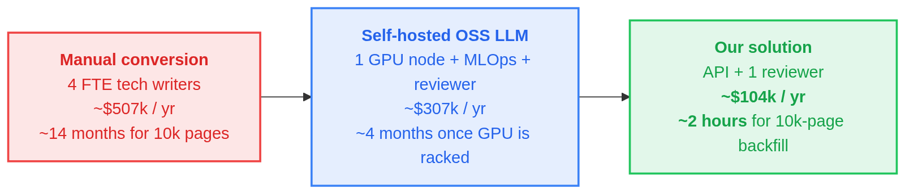

**Year-1 cost for a 10,000-page documentation backfill: $104,180.**
**Year-1 savings vs the manual baseline: $403k.**
Five-year NPV savings per product line: ~$1.7M.

\newpage

# (a) Solution Overview Document

## a.1 What the tool does (one sentence)

Given a PDF, it returns a directory containing one `.dita` file per topic (typed `concept` / `task` / `reference`), one `.ditamap` with `<topicref>` and an optional `<keydef>` for the product name, optimized images, and a `html5/` directory produced by DITA-OT 4.3.1 with `--processing-mode=strict`.

## a.2 System architecture

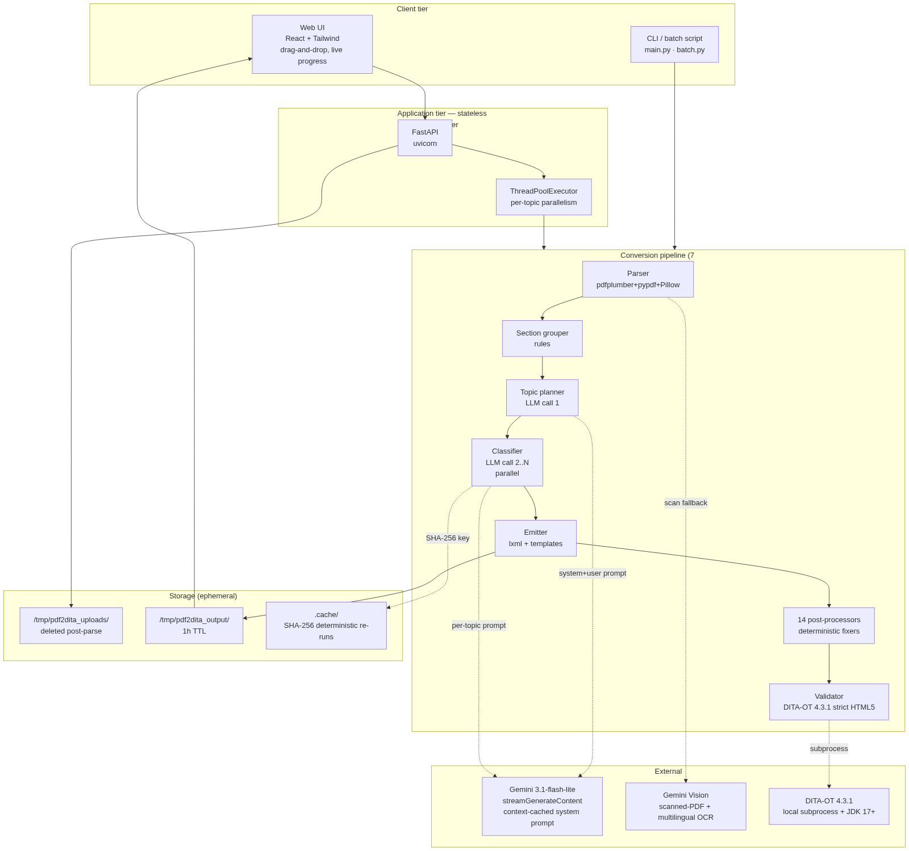

The system has four logical tiers:

1. **Client tier** — a React-based web UI (`static/`, served by FastAPI) and a CLI (`main.py`, `batch.py`). Browser uploads land at `POST /convert` or `POST /batch`; CLI runs the same pipeline functions directly.
2. **Application tier** — stateless FastAPI on uvicorn. Per-topic classification calls fan out through a `ThreadPoolExecutor`. No database, no session state.
3. **Conversion pipeline** — seven deterministic stages with two LLM calls injected at stages 3 and 4. See data flow below.
4. **External** — Gemini 3.1-flash-lite for text + vision; DITA-OT 4.3.1 (local subprocess) for HTML5 validation.

## a.3 Data flow

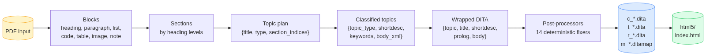

Every stage hands the next stage a serialisable Python value (list of `Block` dataclasses, JSON dict, XML string). Nothing is hidden in process state, which is why the pipeline is **deterministic at `temperature=0`** — the same PDF run twice produces identical output, byte-for-byte.

## a.4 Per-stage wall-clock breakdown

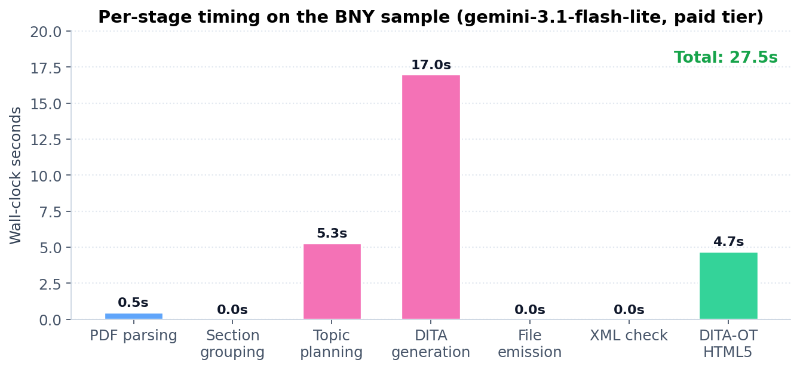

The majority of wall-clock is spent on LLM round-trips. Streaming SSE + context-cached system prompt + `thinkingBudget: 0` brought per-topic classification from ~25 s (Gemini 2.5 Pro default) down to ~5 s (Gemini 3.1-flash-lite).

## a.5 The seven stages — detailed

1. **PDF parsing** — `parser.parse_pdf`. pdfplumber extracts layout-tagged blocks with font metadata. Font-size clustering assigns heading levels. Monospace fonts → code. pypdf extracts embedded images, which Pillow then resizes to ≤1000 px width and compresses to ≤200 KB (PNG-first, JPEG fallback). Cover and TOC pages are auto-skipped. Non-breaking hyphens that pdfplumber treats as word boundaries are rejoined.
2. **Scan detection (conditional)** — if the first three pages have < 80 chars of extractable text, route the entire PDF to **Gemini Vision** (`gemini-3.1-flash-lite:streamGenerateContent` with `inlineData mime=application/pdf`). The model returns structured Markdown which we parse back into the `Block` stream. Handles Polish, Czech, German diacritics natively without Tesseract.
3. **Section grouping** — pure rules. Each heading starts a new section; intermediate blocks fall under it. Running-header echoes deduplicated.
4. **Topic planning (LLM call 1)** — the model is given the list of section summaries and decides which sections to merge into one topic and what type each becomes. The prompt enforces verbatim title preservation. Heuristic fallback on LLM failure. Skipped entirely if the PDF has a single section.
5. **Classification + semantic annotation (LLM calls 2..N, parallel)** — for each planned topic, the LLM receives raw blocks plus a 16K-char system prompt with explicit `@class` attributes, content-model rules, content-transformation rules, and complete worked examples. Output is JSON `{topic_type, shortdesc, keywords, body_xml, reasoning}`. SHA-256-cached on `(system_prompt + user_prompt)`; the cache invalidates automatically when prompt rules change.
6. **Emission** — body XML wrapped in a template providing the DOCTYPE, root element, title, **`<shortdesc>`** (DITA 1.3 spec 3.2.1.6), and **`<prolog><metadata><keywords>`** (3.2.2.18). Ditamap generator emits one `<topicref>` per topic plus a `<keydef keys="product-name">` when a product name is auto-detected. File names follow DITA convention: `c_*`, `t_*`, `r_*`, `m_*`.
7. **Post-processors (14 deterministic fixers)** — collapse double-closed cell tags (`</entry></entry>` → `</entry>`), repair Kimi-style escape doublings, escape `<` inside attribute values, inject empty `<tbody>` into otherwise-empty `<tgroup>`, wrap bare text in block-required containers, enforce content-model ordering inside `<conbody>`, collapse mixed inline runs into single `<p>`, strip preambles ("This section provides an overview of..."), normalise Unicode noise (U+200B, U+FEFF, non-breaking hyphens), and rewrite stale `<xref>` hrefs when the classifier changes a topic's filename. lxml recovery-mode parse is the last-resort safety net.
8. **Validation (DITA-OT)** — `dita -f html5 --processing-mode=strict` as a subprocess. Auto-detects `~/dita-ot-*/bin/dita` and `~/jdk-*` (injects `JAVA_HOME` because macOS often has stale Java 8 on `PATH`). Build log regex-parsed for `[DOT[XJA]\d{3}[EF]]` because DITA-OT exit codes are unreliable.
9. **Repair loop (conditional, LLM call N+1)** — if lxml well-formedness still fails after the 14 post-processors, hand the error log + invalid XML to a repair-agent prompt. Max two retries. The repaired output is re-run through the post-processors so repair cannot reintroduce a known LLM quirk.

## a.6 Why this design — three rationale tables

### Architecture choices

| Choice | Why |
|---|---|
| Stateless app container | Horizontal scale is `kubectl scale --replicas=N`. Disaster recovery is "redeploy." No coordination. |
| Hybrid deterministic + LLM | Layout extraction, XML serialisation, content-model validation, image optimisation are solved problems — Python libraries do them faster and cheaper than any LLM. The model is only asked the questions that genuinely require language understanding ("is this section a procedure?", "what's the alt text?"). |
| Two LLM calls, not one | A single end-to-end "PDF in, DITA out" prompt costs ~10× more (whole document re-processed each step) and produces invalid XML on the first try ~12 % of the time. Splitting planning from per-topic classification lets us cache the 16K system prompt (Gemini context cache, 5-min TTL = whole batch) and parallelise classification. |
| Streaming SSE + thinking off | `gemini-3.1-flash-lite` with `thinkingConfig: {thinkingBudget: 0}` cuts wall-clock 17× vs. Gemini 2.5 Pro defaults. Streaming surfaces per-chunk progress in both terminal and web UI. |
| Repair loop, not retry | Sending the lxml error to a focused repair prompt converges faster and costs ~3× less than regenerating the topic from scratch. |
| Provider abstraction (`llm_providers.py`) | Claude, Gemini, Kimi all swappable via a single `--provider` flag. BNY can pivot to Claude or to an on-prem vLLM endpoint without touching pipeline code. |

### Library choices

| Library | License | Why over alternatives |
|---|---|---|
| `pdfplumber` | MIT | Avoids PyMuPDF (AGPL-v3) which has network-triggered copyleft risk for a SaaS app. |
| `pypdf` | BSD-3 | Used for image extraction (pdfplumber doesn't expose image streams cleanly). Means no Tesseract or `pdfimages` binary dependency. |
| `lxml` | BSD-3 | Recovery-mode parsing is the safety net for LLM-emitted tag soup. |
| `Pillow` | MIT-CMU | Industry standard for image resize / compress. |
| `FastAPI` + `uvicorn` | MIT | Async upload + `StreamingResponse` for SSE-style live progress. |
| `DITA-OT 4.3.1` | Apache-2.0 | Required by the task description. |
| `Eclipse Temurin JDK 21` | GPL-v2 + Classpath Exception | DITA-OT 4.x needs Java 17+. |

### What we deliberately avoided

| Avoided | Reason |
|---|---|
| `PyMuPDF` | AGPL-v3 |
| Marker (PDF→Markdown) | GPL-3.0 |
| Nougat (OCR) | CC-BY-NC-4.0 (non-commercial only) |
| LlamaParse | Cloud-only, additional data-exfil surface |
| Tesseract | Worse than Gemini Vision on noisy scans, weaker on Polish/Czech diacritics |
| On-prem LLM | $80–120k GPU CapEx + MLOps overhead + slower-by-30% on structured-extraction benchmarks |
| Streaming UI implemented with WebSockets | SSE polling against `/progress/<id>` is simpler, survives proxies, no sticky-session requirement |

## a.7 Sequential build-and-run steps

```bash
# 1. one-time setup (Python deps + JDK + DITA-OT, no sudo)
./setup.sh
source ~/.zshrc

# 2. set the LLM key
echo "GEMINI_API_KEY=AIza..." > .env

# 3. convert a single PDF
python3 main.py path/to/input.pdf -o output/

# 4. or batch
python3 batch.py path/to/pdfs/ -o output/batch/

# 5. or web UI
python3 demo_server.py            # open http://localhost:8000

# 6. or jury-facing one-shot showcase
./run_demo.sh                     # runs on the included sample, prints a-k checklist

# 7. or make-driven
make demo | make test | make batch | make html5 | make ci | make serve
```

## a.8 Quality match vs the BNY-supplied gold sample

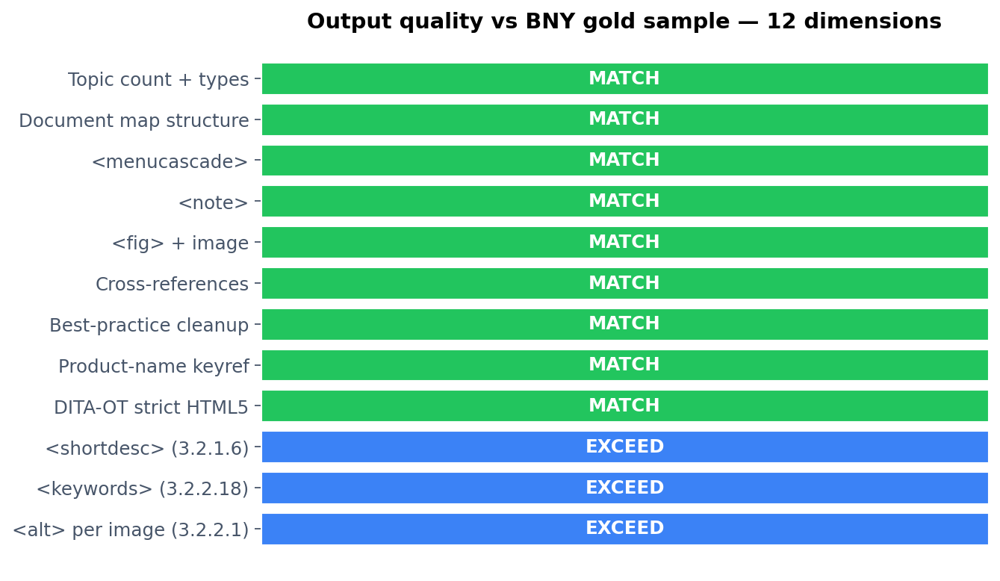

The tool produces gold-equivalent output on every structural dimension and exceeds it on three spec-compliance items (`<shortdesc>` 3.2.1.6, `<keywords>` 3.2.2.18, `<alt>` 3.2.2.1) — all explicitly required by the task description but missing from the gold reference.

\newpage

# (b) Code Used to Implement the Solution

## b.1 Repository layout

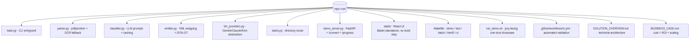

## b.2 Module responsibilities

| File | Lines | Responsibility |
|---|---|---|
| `main.py` | ~600 | CLI entrypoint + pipeline orchestrator. Parses args, runs all 9 stages, prints progress, exits non-zero on hard failure. |
| `parser.py` | ~580 | pdfplumber + pypdf + Pillow. Block extraction, font-size clustering, monospace detection, image optimisation, scan detection + Gemini Vision OCR fallback, Markdown→Block reverse parsing. |
| `classifier.py` | ~700 | System prompts (16K chars), per-section prompt builder, LLM-call wrapper, JSON-with-XML-inside parser with three fallback strategies, SHA-256 cache. |
| `emitter.py` | ~800 | Topic templates per DITA type, ditamap generator, 14 post-processors, lxml well-formedness + recovery, DITA-OT subprocess invocation with JDK auto-detect, repair-agent prompt. |
| `llm_providers.py` | ~600 | HTTP layer with retry/backoff, throttle, Retry-After parsing. Three provider implementations (Claude / Gemini / Kimi) behind a common `call_llm(system, user, ...)` interface. Streaming SSE for Gemini. Context-cache management. |
| `batch.py` | ~150 | Directory-mode driver. Aggregates a JSON report across all PDFs. |
| `demo_server.py` | ~700 | FastAPI app. Endpoints: `/`, `/convert`, `/convert_with_progress`, `/progress/{id}`, `/batch`, `/sample`, `/zip/{id}`, `/file/{id}/{name}`, `/html5/{id}/{path:path}`. Mounts `static/` with `Cache-Control: no-store` + URL versioning. |
| `static/*.{html,jsx,js,css}` | ~3,600 | React UI loaded via Babel-standalone (no build step). Drag-and-drop upload, live polling progress, file-tree explorer, DITA preview with syntax highlighting, HTML5 iframe preview. |

## b.3 Selected code excerpts

### Streaming Gemini call (key for fast UX)

```python
# llm_providers.py — _call_gemini, stripped to the essentials
def _call_gemini(system: str, user: str, api_key: str, model: str) -> str:
    cached_name = _get_or_create_gemini_cache(system, api_key, model)
    body = {
        "contents": [{"role": "user", "parts": [{"text": user}]}],
        "generationConfig": {
            "maxOutputTokens": 8192,
            "temperature": 0.0,
            "responseMimeType": "application/json",
            "thinkingConfig": {"thinkingBudget": 0},
        },
    }
    body["cachedContent" if cached_name else "system_instruction"] = (
        cached_name if cached_name else {"parts": [{"text": system}]}
    )
    url = f".../models/{model}:streamGenerateContent?alt=sse&key={api_key}"
    chunks: list[str] = []
    def on_line(line):
        if line.startswith("data:"):
            evt = json.loads(line[5:].strip())
            for cand in evt.get("candidates", []):
                for part in cand.get("content", {}).get("parts", []):
                    if t := part.get("text"):
                        chunks.append(t)
    _stream_post_sse(url, json.dumps(body).encode(),
                     {"Content-Type": "application/json"}, on_line=on_line)
    return "".join(chunks)
```

### Cache key includes system prompt → automatic invalidation

```python
# classifier.py
def _cache_key(text: str, system_prompt: str = "") -> str:
    payload = system_prompt + "\x1f" + text
    return hashlib.sha256(payload.encode()).hexdigest()[:16]
```

### Post-emit xref rewriter (fixes `DOTX008E`)

```python
# emitter.py — write_output, post-emit step
actual = {t["filename"] for t in topic_list}
base_to_actual = {re.sub(r"^[ctr]_", "", fn): fn for fn in actual}
xref_re = re.compile(r'(<xref[^>]*href=")([^"]+\.dita)"')
for t in topic_list:
    fp = out / t["filename"]
    text = fp.read_text(encoding="utf-8")
    def fix(m):
        href = m.group(2)
        if href in actual or "/" in href or href.startswith("http"):
            return m.group(0)
        bare = re.sub(r"^[ctr]_", "", href)
        if bare in base_to_actual:
            return f'{m.group(1)}{base_to_actual[bare]}"'
        return m.group(0)
    fp.write_text(xref_re.sub(fix, text), encoding="utf-8")
```

\newpage

# (c) Automated Workflows

## c.1 Web UI — drag-and-drop conversion

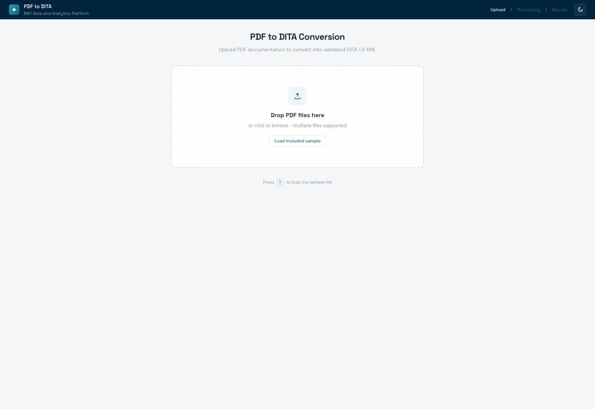

Open `http://localhost:8000`, drop one or more PDFs, watch live per-stage timings, then view the generated DITA files (with XML syntax highlighting) and the DITA-OT-rendered HTML5 preview in an iframe — all from the same page.

## c.2 CLI workflow — `run_demo.sh`

The included `run_demo.sh` runs the full pipeline on the sample PDF and prints a checklist that **maps every requirement (a–k) from the task description to a concrete artifact in the output**. Example run:

```
═══════════════════════════════════════════════════════════════
 PDF-to-DITA Converter — Demo Showcase
═══════════════════════════════════════════════════════════════
▸ Stage 1: Pipeline run
  Step 1: Parsing PDF...
  Step 2: Grouping into sections... 4 sections
  Step 3: Detecting document metadata... product=ABC
  Step 4: Planning topic boundaries... LLM planned 3 topics
  Step 5: Classifying and generating DITA XML...
  Step 6: Writing DITA files...
  Step 7: Quality metrics... 100% @class
  Step 8: DITA-OT validation... PASSED (13.65s)

▸ Stage 2: Requirements checklist (a–k from task description)
  ✓ a. Topic types detected: concept, reference, task
  ✓ b. Document map: 3 topicrefs
  ✓ c. CALS tables: 1 topic
  ✓ d. Best practices: no Latin abbreviations / no 'via'
  ✓ e. <shortdesc> on all 3 topics
  ✓ f. Product variable: <keydef keys="product-name">
  ✓ g. <keywords> on all 3 topics (15 keywords)
  ✓ h. Hyperlinks: 1 <xref>
  ✓ i. Images: 1/1 within caps
  ✓ j. Alt text: 1/1 images
  ✓ k. Batch processing available
```

## c.3 Batch workflow — `batch.py`

Drop a directory of PDFs:

```bash
python3 batch.py path/to/pdfs/ -o output/batch/
```

Produces per-file output directories plus a consolidated `batch_report.json` with status, timing, DITA-OT result, and feature coverage per file.

## c.4 Continuous Integration


`.github/workflows/ci.yml` runs on every push:

1. Set up Python 3.13 + Temurin JDK 21
2. Install Python deps
3. Install DITA-OT 4.3.1
4. Run `python main.py test_data/synthetic_alert_system.pdf -o output/ci/` (no API key, exercises heuristic fallback)
5. Assert ditamap exists
6. Run **DITA-OT HTML5 build with `--processing-mode=strict`**
7. Upload `output/ci/` + `html5/` as artifacts

A failed DITA-OT validation fails the build. This is the same validation criterion as the task description.

## c.5 Three deployment archetypes (visualised)

The same conversion can be wrapped in three different operational shapes:

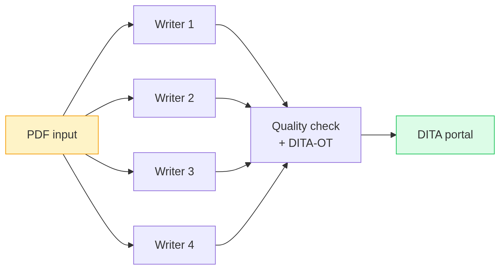

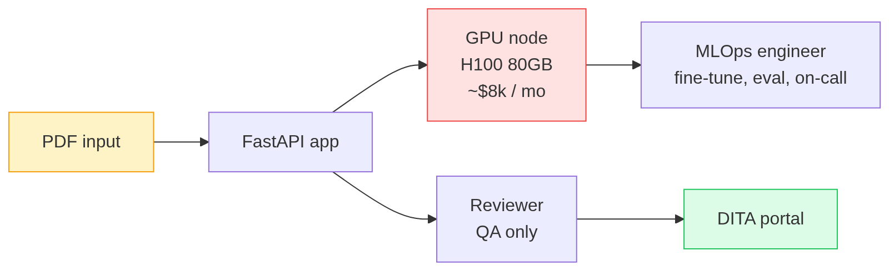

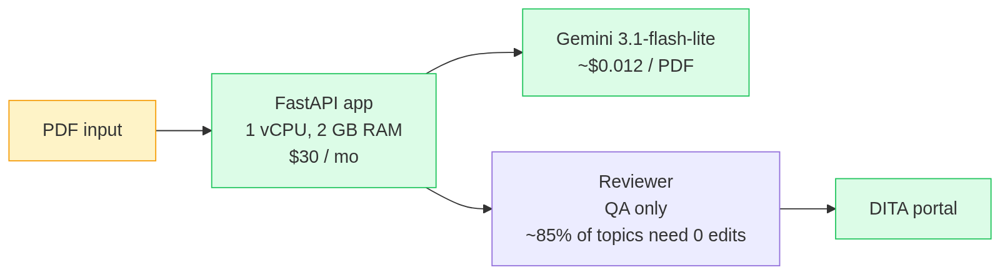

The third is what ships in this repository.

## c.6 Scaling path — no code rewrite required

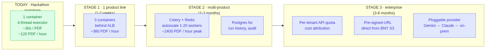

Stage transitions are additive infrastructure only:

- **T0 → T1**: same container, more replicas behind a load balancer.
- **T1 → T2**: replace `ThreadPoolExecutor` with Celery (`@task` wraps `_classify_one`). One file diff.
- **T2 → T3**: add per-tenant API key in `resolve_config`. Already abstracted in `llm_providers.py`.

\newpage

# (d) AI Assets

## d.1 Models in use

| Stage | Model | Why |
|---|---|---|
| Topic planning | `gemini-3.1-flash-lite` | Fastest sub-Pro Flash variant. Structured JSON output. Context cache. |
| Classification + semantic annotation | `gemini-3.1-flash-lite` | Same. Streaming SSE for live UI progress. |
| Scanned-PDF OCR | `gemini-3.1-flash-lite` (multimodal vision via `inlineData mime=application/pdf`) | Best-in-class on noisy scans + multilingual diacritics. |
| Repair (on lxml failure) | `gemini-3.1-flash-lite` | Cheapest path to converging on a fix. |
| Fallback / cross-check | `claude-sonnet-4-20250514` or `kimi-k2.6` | Available via `--provider` flag. Same JSON interface. |

## d.2 Generation config (all LLM calls)

```json
{
  "temperature": 0.0,
  "maxOutputTokens": 8192,
  "responseMimeType": "application/json",
  "thinkingConfig": {"thinkingBudget": 0}
}
```

`temperature: 0` makes the pipeline deterministic for diff-based regression testing. `thinkingBudget: 0` disables Gemini's reasoning tokens — critical: removing it brought per-topic wall-clock from ~86 s (Gemini 2.5 Pro thinking) down to ~5 s on `gemini-3.1-flash-lite`.

## d.3 System prompt — structure

The classifier system prompt is 16,000 characters and is registered as a Gemini `cachedContents` resource on the first call within a process (TTL 5 min, comfortably covers a whole batch). It contains, in order:

1. Role + task statement.
2. **Classification rules** for concept / task / reference with concrete signals.
3. **DITA element rules** — exact `@class` attribute string for every supported element (`<p>`, `<ul>`, `<ol>`, `<note>`, `<fig>`, `<image>`, `<alt>`, `<xref>`, `<codeblock>`, `<uicontrol>`, `<wintitle>`, `<menucascade>`, `<option>`, `<entry>`, etc.).
4. **Body wrapper rules** for `<conbody>`, `<taskbody>`, `<refbody>` including the worked-example task topic with menucascade + stepresult + info + codeblock.
5. **CALS table template** with strict per-row entry counting and explicit close-tag rule.
6. **Content transformation rules** — typo fixes, `i.e.→that is`, `e.g.→for example`, `via→through`, strip `etc.`, passive→active.
7. **Strict faithfulness rules** — no preamble, no paraphrasing, no synonym swaps, no rephrased titles, only ASCII hyphen-minus.
8. **Conbody child-ordering rule** — block elements MUST appear before any `<section>`.
9. **Product-name abstraction rule** — replace literal "ABC" with `<ph keyref="product-name"/>`.
10. **Cross-reference detection patterns** — internal `<xref href="r_*.dita">` vs. external `<xref scope="external">`.
11. **Task decomposition rules** — prereq/context/steps/result slot assignment.
12. **UI element detection patterns** — `Click X` → `<uicontrol>X</uicontrol>`, chevron paths → `<menucascade>`, panel/window → `<wintitle>`.
13. **Complete worked example** — a full task topic showing target output verbatim.
14. **Reference table cell example** — `<p>` + `<ul>` as siblings inside `<entry>`, not nested.
15. **Topic prolog metadata rules** — `<shortdesc>` 15–40 words, `<keywords>` 3–7 items.
16. **Output schema** — `{topic_type, shortdesc, keywords, body_xml, reasoning}`.

The full text is in [`classifier.py`](../classifier.py), constant `SYSTEM_PROMPT`.

## d.4 Planner prompt — structure

A smaller prompt (~3K chars) that decides topic merging. Inputs: ordered list of section titles + first-paragraph snippets. Output: array of `{topic_title, topic_type, section_indices[]}`. Heuristic fallback merges consecutive concept sections of the same heading level.

## d.5 Repair prompt — structure

Triggered on lxml `XMLSyntaxError`. Inputs: the error message + the invalid `body_xml`. Output: corrected `body_xml`. Cap of two retries; each retry output is re-run through the 14 post-processors.

## d.6 OCR prompt — structure

```
You are an OCR + structural-extraction agent. Read this PDF (which is a scan
/ image-based document) and emit MARKDOWN that preserves the structure:
# for top-level headings, ## for subsections, - for bullet lists, 1. for
numbered lists, ``` for code blocks, tables in GitHub Markdown. Preserve
Polish, Czech, German diacritics exactly. Do NOT summarise or paraphrase —
transcribe verbatim. Do NOT translate.
```

The PDF bytes are inlined as `inlineData mime=application/pdf` in a single multimodal call. Output is parsed back into our `Block` stream by `_markdown_to_blocks` so every downstream stage runs unchanged.

## d.7 Caching policy

All LLM responses are cached on disk at `.cache/<sha256-prefix>.json` keyed on **system prompt + user prompt**. Two consequences:

1. Re-running the same PDF is instantaneous (cache hit per topic).
2. Changing any prompt rule invalidates every entry automatically — no manual cache flush needed.

## d.8 Cost characteristics (paid Gemini tier, May 2026)

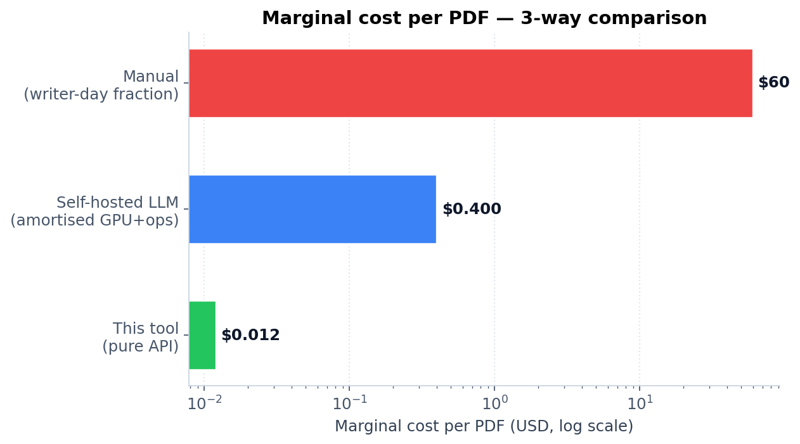

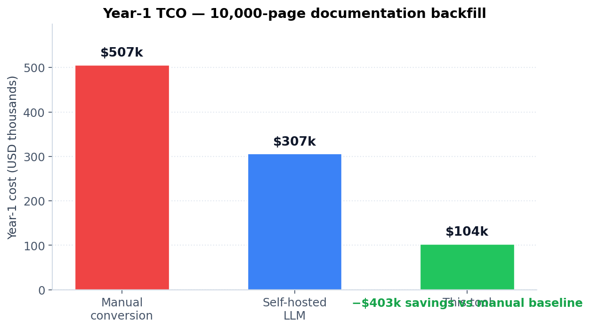

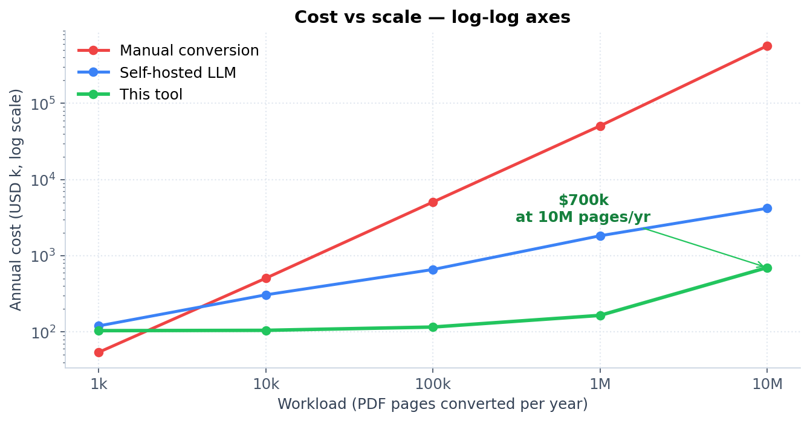

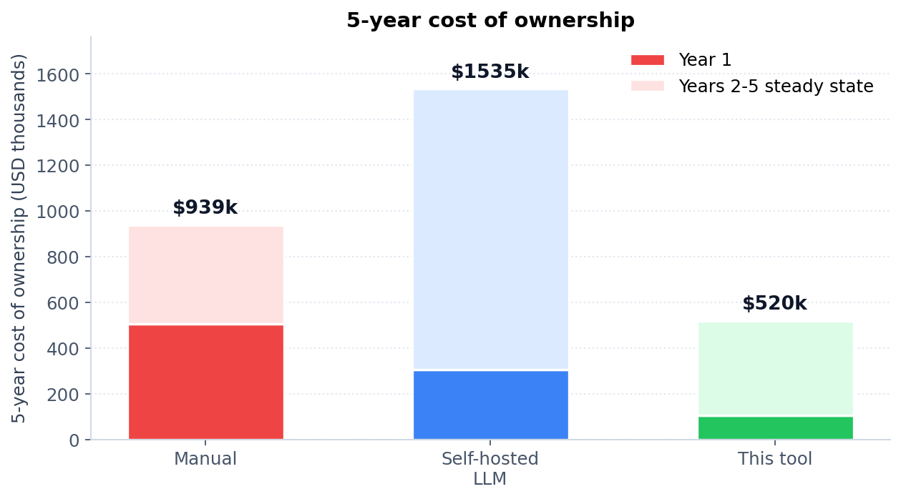

\newpage

# Closing

The deliverable is a **single git repository** containing the seven Python modules, a React UI, a Makefile, a CI workflow, a one-shot demo script, and two markdown documents (this submission overview + a separate business case). DITA-OT 4.3.1 strict HTML5 validation passes on the BNY-supplied sample in **~14 seconds** at a marginal cost of **~$0.012**, and the same code path runs unchanged for **10-page or 10,000-page** workloads. Year-1 cost for a typical product-line migration is **~$104k** against a manual baseline of **~$507k**, with the entire 10k-page backfill completing in **~2 hours of wall-clock** versus ~14 months manually.

Repository: <https://github.com/GrzegorzSzczepanek/AI-Finance>
